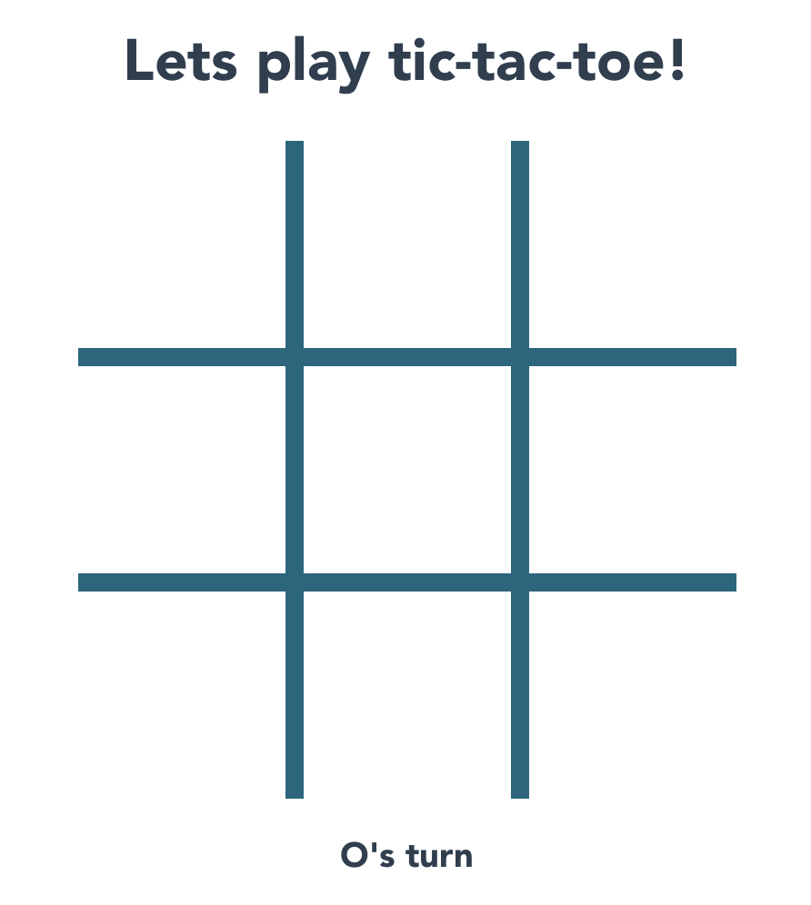
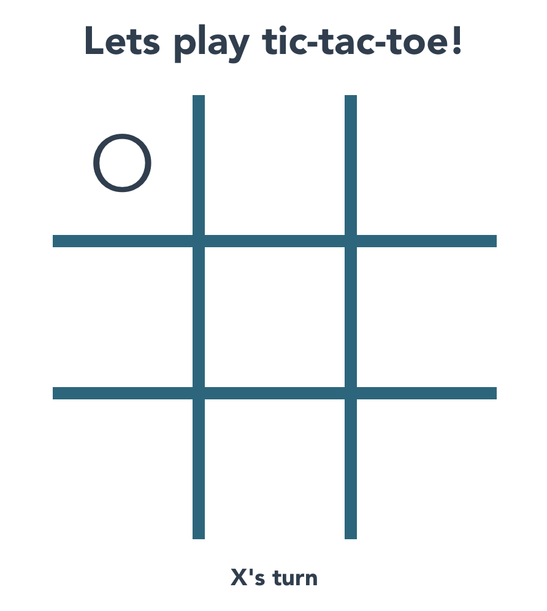

# Tic Tac Toe

This is a simple front-end Tic Tac Toe game that I built to learn Vue.js before my internship with Yup.

## Screenshots





## Project setup
```
npm install
```

### Compiles and hot-reloads for development
```
npm run serve
```

### Compiles and minifies for production
```
npm run build
```
